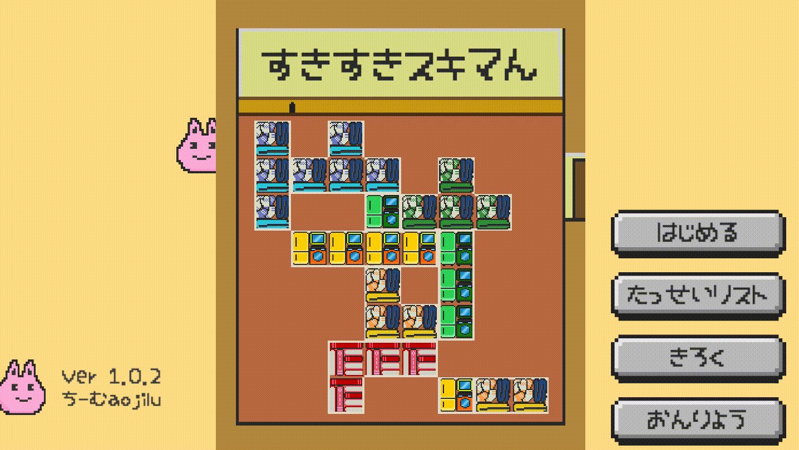

# すきすきスキマん

Unity1Weekゲームジャム「あける」

](https://unityroom.com/games/sukisukisukiman)

## ちーむaojilu
- aojilu: リーダー、システム
- SilCil: システム統括
- kugi: デザイン、チームビルド、システム
- すなじろ: サウンド

## アセット
- [効果音ラボ](https://soundeffect-lab.info/) 様: SEとして使用させていただきました。
- [魔王魂](https://maoudamashii.jokersounds.com/) 様: SEとして使用させていただきました。
- [Asterism](https://www.asterism-m.com/about/) 様: *[ゆるもじフォント](https://www.asterism-m.com/font/bmp-2byte/)* を使用させていただきました。
- [naichi](https://github.com/naichilab) 様: *[unityroom-tweet](https://github.com/naichilab/unityroom-tweet)* を使用させていただきました。
- [UnityTeamDevTemplate](https://github.com/TeamAojilu/UnityTeamDevTemplate) by ちーむaojilu